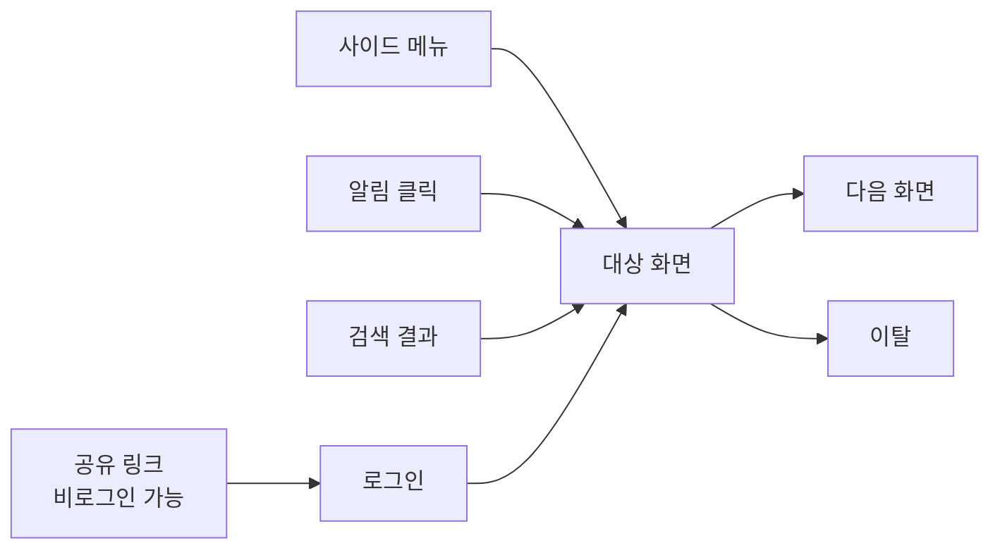
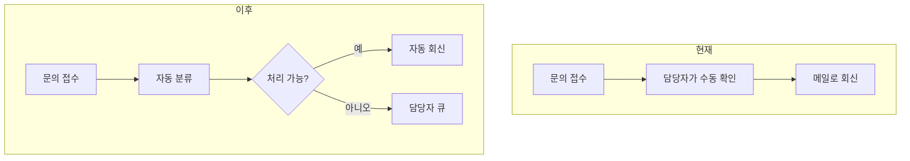
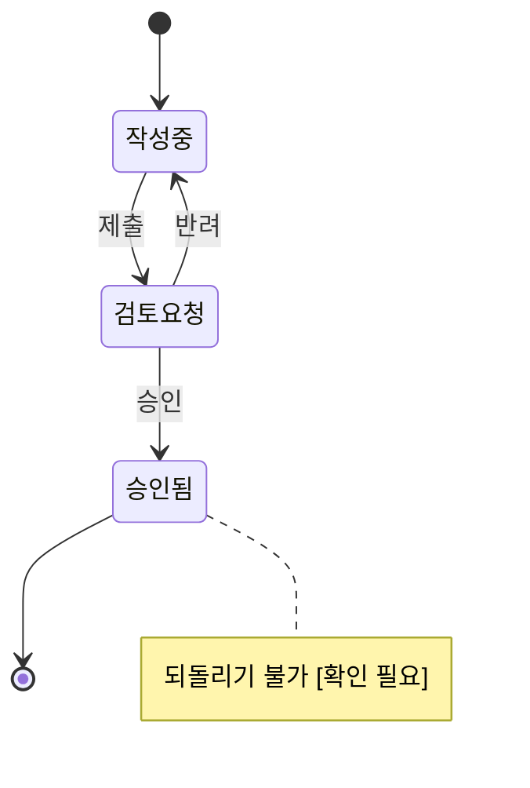
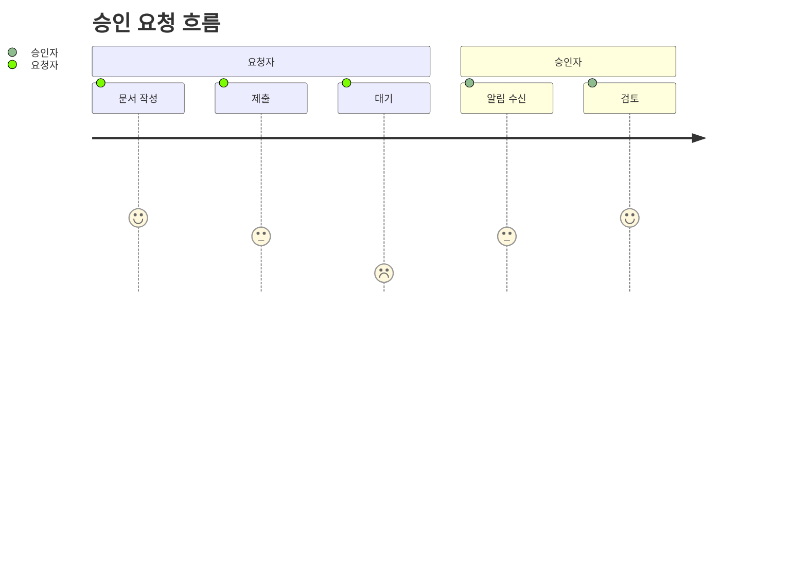

# 흐름 맵 · 와이어프레임 작성 가이드

[1-3] 흐름 맵과 [2-2] 프로토타입을 그릴 때 읽는다.

**표기 원칙 하나**: 마크다운 문서(워크시트)에는 **mermaid**, 프로토타입 HTML에는 **CSS 박스**를 쓴다.
HTML은 로컬에서 파일로 열리므로 외부 CDN에 의존하면 흐름도가 통째로 안 보일 수 있다. 마크다운은 GitHub·Notion·대부분의 뷰어가 mermaid를 그대로 렌더한다.

---

## 1. 흐름 맵 — mermaid 패턴

### 1-1. 진입 경로 맵 — "어디서 들어오는가"

**진입 경로가 하나뿐인 것처럼 그리지 않는다.** 빠진 경로가 여기서 드러난다.



- 진입 노드는 **전부** 적는다. 메뉴·딥링크·알림·검색·공유·온보딩
- 비로그인으로 들어올 수 있는 경로는 따로 표시한다
- **나가는 경로도 그린다.** 끝이 안 그려지면 "끊긴 상태"를 못 찾는다

### 1-2. before / after — "지금은 어떻게 하고 있는가"

두 개를 **나란히** 놓는다. 하나만 그리면 개선 폭이 안 보인다.



### 1-3. 상태 흐름 — 객체에 상태가 있을 때만



**못 가는 경로를 note로 남긴다.** 상태 설계에서 사고는 대부분 "갈 수 있다고 생각했는데 못 가는" 지점에서 난다.

### 1-4. 여정 스냅샷 — 역할이 갈릴 때만



점수는 **만족도가 아니라 마찰**로 읽는다. 낮은 지점이 이 기능이 손댈 곳이다. 근거 없이 점수를 지어내지 말 것 — 확신이 없으면 이 다이어그램을 쓰지 않는다.

### 1-5. [2]의 흐름 표시와 겹치지 않게

프로토타입 HTML에도 `.flow` 박스 체인이 있지만 **그리는 대상이 다르다.**

| | 그리는 것 | 매체 |
|---|---|---|
| [1-3] 흐름 맵 | 전체 흐름 + 모든 진입 경로, as-is 포함 | 마크다운 mermaid |
| [2] `.flow` | 그 안에서 **이 안이 붙는 구간만** 잘라낸 것 | HTML CSS 박스 |

[2]에서 전체 흐름을 다시 그리고 있으면 잘못 가고 있는 것이다. 안마다 달라지는 구간만 보이면 된다.

### 1-6. 하지 말 것

- **노드 15개를 넘기지 않는다.** 넘으면 흐름이 아니라 지도가 된다. 범위를 덜 자른 신호
- 한 다이어그램에 진입·상태·역할을 다 넣지 않는다. 목적당 하나
- 확정되지 않은 분기를 확정처럼 그리지 않는다 → 노드 라벨에 `[확인 필요]`를 붙인다
- 스타일링(`classDef`, 색상)을 넣지 않는다. 와이어프레임 단계에서 색은 판단을 왜곡한다

---

## 2. 와이어프레임 — 무엇을 그리고 무엇을 안 그리는가

### 2-1. 판단 기준

**"이게 없으면 안들끼리 구분이 안 되는가?"** 답이 아니오면 넣지 않는다.

| 넣는다 | 넣지 않는다 |
|---|---|
| 요소의 **위치와 순서** | 색상, 그림자, 아이콘, 브랜딩 |
| 정보의 **위계** (제목 / 본문 / 보조) | 실제 카피 — `[제목]`, `[설명 2줄]`로 |
| **주요 액션 버튼**과 그 위치 | 부차적 액션(설정·도움말·공유) |
| **분기·상태**가 화면에 드러나는 방식 | 애니메이션, 트랜지션, 호버 효과 |
| 목록이면 **행 3개 정도** | 실제 데이터, 그럴싸한 더미 이름 |
| 빈 상태가 안마다 다르면 그 화면 | 안마다 똑같은 빈 상태 |

**"있으면 좋고 없어도 그만"인 요소는 과감히 뺀다.** 프로토타입이 무거워지면 비교가 안 되고, 사용자가 결정 대신 디테일을 보게 된다.

### 2-2. 미확정 영역

그럴싸하게 채우지 않는다. **눈에 띄게** 남긴다.

```html
<div class="ph">[확인 필요] 정렬 기준 — 최신순 / 인기순 / 담당자순</div>
```

placeholder가 시각적으로 튀어야 하는 이유는, 이게 **최종 디자인이 아니라 결정 도구**라는 사실이 한눈에 보여야 하기 때문이다. 회색으로 얌전히 처리하면 사용자가 "다 됐네"로 읽는다.

**탭 안에만 두면 전체가 안 보인다.** 안이 4개면 `[확인 필요]`도 4곳에 흩어지고, 사용자는 탭을 전부 눌러야 미확정 전체를 파악한다. 템플릿 하단의 "미확정 모아보기"가 `.ph` 요소를 자동으로 긁어 한 목록으로 만든다 — **직접 채우지 말 것.** 손으로 적으면 화면 안의 것과 어긋난다.

모아보기가 비어 있으면 두 가지 중 하나다. 정말 다 정해졌거나, **모르는 걸 채워 넣었거나.** 후자가 훨씬 흔하다.

### 2-3. 안마다 얼마나 그리는가

**대표 화면 1~2개.** 전체 화면을 다 그리지 않는다.

고르는 기준은 **"안들끼리 갈리는 화면"**이다. A안과 B안이 똑같이 생긴 화면은 그릴 필요가 없다. 목록 화면은 같고 상세만 다르면 상세만 그린다.

빠르게 여러 개가 목적이다. **하나를 완성도 높게 마무리하는 데 시간을 쓰지 않는다.**

### 2-4. UI 형태는 되묻지 않는다

"모달로 할까요, 페이지로 할까요?" 같은 질문을 던지지 않는다. 가장 직관적인 형태를 골라 그냥 그린다.

그렇게 그린 형태가 **사용성 측면에서 애매함을 유발할 때만** 그 지점에 `[확인 필요]`를 붙인다. 표현 방식 자체를 어떻게 할지 되묻지는 않는다.

```
좋음:  [확인 필요] 항목이 50개를 넘으면 이 모달에서 스크롤이 길어짐 — 페이지 분리 검토
나쁨:  이 화면을 모달로 할까요 전체 페이지로 할까요?
```

---

## 3. 프로토타입 HTML 규약

`assets/prototype-template.html`의 구조를 그대로 따른다.

- **파일 1개**에 모든 안을 담는다. 파일명 `00_프로토타입.html`. 나누면 창을 오가느라 비교가 안 된다
- **외부 의존성 없음.** CDN 스크립트·웹폰트·이미지 URL을 쓰지 않는다. 로컬에서 더블클릭으로 열려야 한다
- 안마다 **헤더 카드**(핵심 한 줄 / 크기 / 성립 조건 / 기술 관점 / 판단 포인트)와 **화면 영역**을 세트로 둔다
- 흐름 내 위치는 CSS 박스 체인으로 표현한다 (`.flow` > `.step`). mermaid를 HTML에 넣지 않는다
- 클릭으로 안 사이를 전환할 수 있게 한다 — 나란히 놓고 갈아끼우며 봐야 비교가 된다
- 상단에 "이 문서는 와이어프레임입니다 — 최종 디자인이 아닙니다" 배너를 유지한다

---

## 4. 자주 나오는 실패

| 증상 | 원인 | 대응 |
|---|---|---|
| 안 3개가 다 비슷하다 | 축을 안 섞었다 | [2-1]의 네 축(최소·정공법·수동우회·재활용) 재확인 |
| 사용자가 색·문구만 지적한다 | 와이어프레임 수준을 넘었다 | 디테일을 덜어낸다 |
| 판단이 안 선다고 한다 | 너무 추상적이거나 판단 포인트가 안 보인다 | 안마다 "이 안을 볼 때 확인할 것" 한 줄을 노출 |
| 추천을 그냥 승인하고 넘어간다 | 결론을 바꾸는 미지수가 특정 안의 판단 포인트에 묻혔다 | 상단 "결론을 바꾸는 미지수" 블록으로 올린다 |
| 미확정을 놓친다 | `[확인 필요]`가 탭마다 흩어져 있다 | 하단 "미확정 모아보기"가 자동 수집하는지 확인 |
| 흐름도가 안 읽힌다 | 노드가 많거나 목적이 섞였다 | 목적당 하나로 쪼갠다 |
| 진입 경로가 없는 안이 뒤늦게 발견된다 | 진입 경로 맵을 안 그렸다 | [1-1]을 [3-2] 전에 반드시 |
