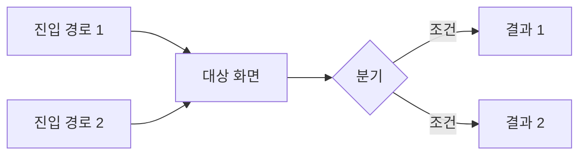

# [기능명] MVP PRD

> 작성일 / 작성자 / 상태(리뷰 요청·확정) / 탐색 워크시트 링크
> **분량 목표: A4 2~3장.** 선택 이유·검토 과정은 워크시트에 있으니 여기서 반복하지 않는다.
> 이 문서는 MVP 기준이다. 확정된 것만 적고, 확정되지 않은 것은 5번 미결 항목으로 올린다.
> **여기 넣지 않는 것:** 상세 데이터 모델, API 설계 전체, 운영·모니터링 체계, 확장성·고도화 설계.

## 0. 한 장 요약

| 항목 | 내용 |
|---|---|
| 해결하는 문제 | |
| 대상 사용자 | |
| 이번 범위 | |
| 이번 범위 아님 | |
| 성공 판단 기준 | |
| 미결 항목 | ○건 (5번) |

## 1. 배경

[왜 지금 이걸 하는가. 3~5줄. 정성 형용사 대신 사실로]

**맥락 미확인 영역**
[확인하지 못한 채 진행한 부분. 없으면 "없음"]

## 2. 전역·중요 정책

여러 화면에 걸쳐 적용되거나, 어기면 사고가 나거나, 구조를 짜기 전에 알아야 하는 규칙만.

### 2-1. 권한 정책
| 역할 | 가능한 동작 | 제한 |
|---|---|---|

### 2-2. 상태 전이
| 현재 상태 | → 가능한 상태 | 조건 | 되돌리기 |
|---|---|---|---|

### 2-3. 데이터 정책
[삭제·보존·마이그레이션·중복 규칙]

### 2-4. 과금·한도 영향
[없으면 "없음"이라고 명시]

## 3. 기능 명세

기능마다 아래 블록을 반복. **5개를 넘으면 범위를 덜 자른 것이다.**

### F-1. [기능명]

- **페이지 카테고리**: 
- **대상 사용자**: 
- **자잘한 정책**: [이 화면에서만 적용되는 노출 조건·문구·정렬]

**BDD 시나리오**

*정상 흐름*
```
Given [상황]
When  [행동]
Then  [결과]
```

*예외 — [케이스명]*
```
Given
When
Then
```

**완료 조건**
- [ ] [기능 축 — 검증 가능한 문장으로. "원활하게 동작" 금지]
- [ ] [비기능 축 — 권한·데이터·정책·성능·안정성 중 **지금 확정된 것만.** 확정 안 된 건 5번 미결로]

## 4. 화면 흐름

**진입 경로를 빠짐없이 적는다.** 여기가 얇으면 어느 화면에서도 도달할 수 없는 기능이 나온다.
탐색 워크시트 1번의 흐름 맵이 있으면 이번 범위로 좁혀서 옮긴다. 시안이 있으면 링크만.



| 진입 경로 | 들어오는 역할 | 비로그인 가능 |
|---|---|---|
| | | |

## 5. 미결 항목

**임의로 채우지 않은 것들.** 리뷰에서 답을 받아야 다음 단계로 간다.
결정 영역은 사람 이름이 아니라 영역으로 적는다 — 누가 읽어도 자기 몫이 보이도록.

| # | 질문 | 왜 필요한가 | 결정 영역 | 기한 |
|---|---|---|---|---|
|  |  |  | 제품/기술/디자인/비즈니스 |  |

## 6. 미확정 기술 결정

구현 방식을 추측해서 쓰지 않고 열어둔 항목. 개발자가 이 문서를 쓰는 경우 여기서 바로 채운다.

| 항목 | 선택지 | 결정에 필요한 정보 |
|---|---|---|

## 7. 범위 밖

[이번에 하지 않는 것. 리뷰 중 범위가 부푸는 걸 막는 장치]

## 8. 가정과 잔여 질문

부족함을 숨기는 곳이 아니라 **현재 상태를 투명하게 남기는 곳**이다. 다음 단계는 여기서 출발한다.

**가정으로 처리한 것**

| 가정 | 왜 이렇게 뒀나 | 틀렸을 때 무너지는 것 |
|---|---|---|

**아직 확인하지 못한 것 / 나중에 확인할 것**
-

**방향은 확정됐지만 세부가 열려 있는 지점**
-

## 9. 리뷰에서 봐줬으면 하는 것

[읽는 사람이 무엇을 확인하면 되는지. 2~3줄이면 충분]

## 10. 다음 단계에서 다룰 것

[MVP 이후 고도화 대상. 지금 설계가 이걸 막지 않는지만 확인]
