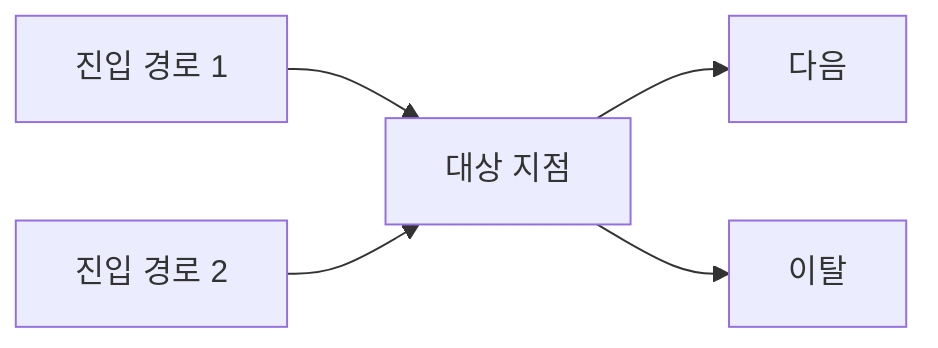

# [기능명] 탐색 워크시트

> Phase 0~2 의사결정 기록. PRD가 아니라 **왜 이 방향인지**를 남기는 문서.
> 작성일 / 작성자 / 상태(초안·확정)
>
> **0~7번은 start-big-idea가 채울 수 있다.** 그 스킬을 거쳐 왔으면 8번부터 이어서 쓴다.
> start-prd만 쓰는 경우에는 처음부터 끝까지 이 파일 하나로 간다.

## 0. 맥락 정렬

**확인한 것** (5줄 이내)
-

**확인한 소스**
| 종류 | 위치 |
|---|---|

**맥락 미확인 영역**
[확인하지 못한 채 진행한 부분. 이후 판단에 `[맥락 미확인]` 표시]

## 1. 문제 정의

**한 문장 정의**
[해법이 아니라 문제로]

**누가 겪는가** — [역할 / 상황 / 빈도]

**지금 어떻게 우회하고 있는가**

**검토한 문제 프레이밍**
| 프레이밍 | 이렇게 보면 해법이 이렇게 됨 |
|---|---|

**흐름 맵 — 진입 경로와 before/after**

기능을 "섬"으로 보면 나중에 진입 경로가 없는 명세가 나온다. mermaid로 그린다.
진입 노드는 빠짐없이(메뉴·알림·딥링크·검색·공유·비로그인), **나가는 경로까지** 그린다.

| | 지금(before) | 이후(after) |
|---|---|---|
| 사용자가 하는 일 | | |
| 걸리는 지점 | | |

## 2. 제약 조건

- 일정:
- 붙어야 하는 기존 기능:
- 기술·조직 한계:

## 3. 벤치마킹 (요청 시에만)

> 사용자가 요청하지 않았으면 **"실행 안 함"** 한 줄로 두고 넘어간다.
> 실행했다면 **2~3개까지만.** 확인한 것과 추정을 구분하고, 추정에는 `[추측]`을 붙인다.

**실행 여부:** [실행 안 함 / 실행 — 사용자 요청]

| 사례 | 어떻게 풀었나 | 그들의 전제가 우리와 같은가 | 우리가 가져올 것 하나 |
|---|---|---|---|

**가져오지 않기로 한 것** [보이는 결과물만 베끼면 남의 제약까지 물려받는다]
-

## 4. 해법 후보

| # | 후보 | 크기 | 성립 조건(가정) | 기술 관점 (의존성 / 리스크) |
|---|---|---|---|---|
| A |  | S/M/L |  |  |
| B |  |  |  |  |
| C |  |  |  |  |

> 기술 관점은 한 줄이면 된다 — 무엇에 물려 있고(기존 정책·외부 서비스·데이터·권한), 어디가 위험해 보이는지.

## 5. 비교

| 기준 | A | B | C |
|---|---|---|---|
| 고객 적합도 |  |  |  |
| 기존 정책과의 충돌 |  |  |  |
| 기술 파급 |  |  |  |
| 개발 비용 |  |  |  |
| 되돌리기 비용 |  |  |  |

## 6. 선택

**선택: [ ]**

**이유** [3줄 이내]

**이 판단이 의존하는 가정**

| 가정 | 틀렸을 때 무너지는 것 |
|---|---|

## 7. 버린 안과 이유

| 후보 | 버린 이유 | 다시 검토할 조건 |
|---|---|---|

> 여기까지가 start-big-idea 인계 범위다. 아래 8~13번은 start-prd가 채운다.

## 8. MVP 경계

**이번에 한다**
-

**다음에 한다**
-

**안 한다**
-

## 9. 역할 카드

Phase 3 시나리오 드라이런의 입력. **Phase 0의 권한 구조에서 파생시킨다 — 인물을 지어내지 않는다.**
이번 기능에서 동작이 갈리는 역할만 **2~3개.**

| 역할 | 이 기능을 쓰는 목적 | 가진 권한·제약 | 막히면 곤란해지는 것 |
|---|---|---|---|

## 10. 지금 보이는 엣지·리스크

방향 확정 시점에 이미 보이는 것들. Phase 3 엣지케이스 심문의 출발점이 된다.
**승인받기 전에 보여준다** — 승인 후에 나오는 리스크가 방향을 뒤집는다.

| 구분(엣지/리스크/정책 충돌) | 내용 | 방향에 영향을 주는가 |
|---|---|---|

## 11. 성공 판단 기준

[지표 또는 관찰 가능한 변화. 없으면 "미정 — 결정 영역: 비즈니스"]

## 12. 리뷰에서 봐줬으면 하는 것

[읽는 사람이 무엇을 확인하면 되는지. 2~3줄이면 충분]

## 13. 변경 이력

이의 제기 후에도 유지된 결정을 남긴다. 나중에 같은 논의가 반복되는 걸 막는다.

| 날짜 | 변경 내용 | 제기된 우려 | 최종 판단과 이유 |
|---|---|---|---|
